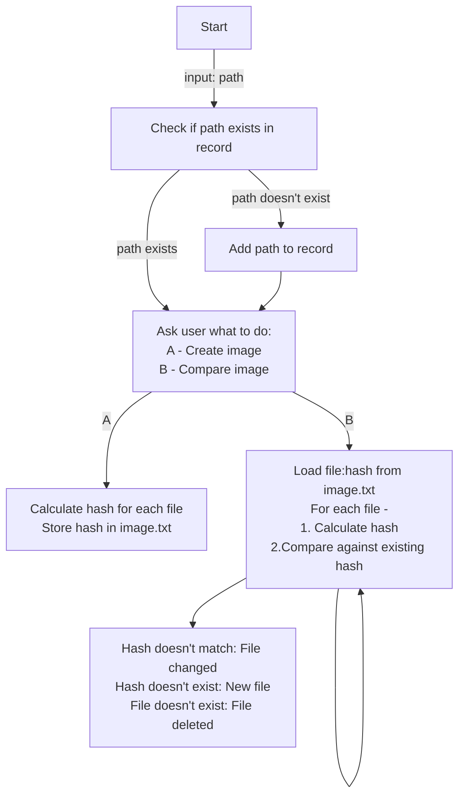

# file-integrity-manager
A File Integrity Monitor (FIM) is used by cybersecurity professionals to detect unauthorised changes to files in a system. This can be used to protect a machine from malware injection and other exploits related with malicious files.

## Process
This program works as follows:

## Usage
    python fm.py <path>
Path should be of a folder which contains only files and not any other folder inside of it

### 1. Adding a new folder to records

### 2. Updating image

### 3. Compare with existing image

### 4. A file content is changed

### 5. A file is deleted

### 6. A new file is created

